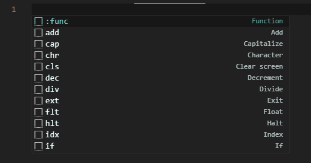
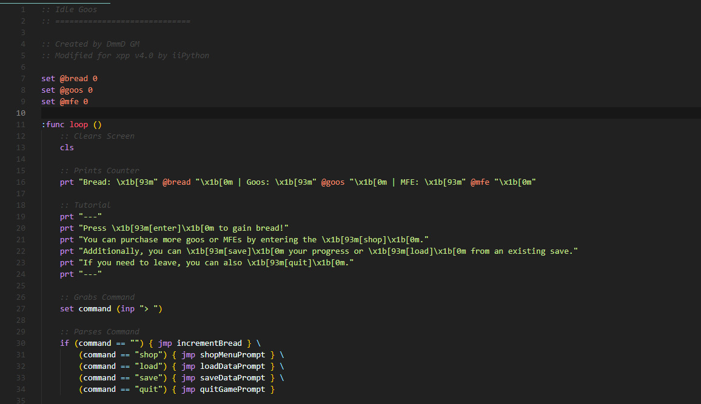

# X++ Extension (xpp-ext)

## About

Hello! This is an extension that provides syntax highlighting and snippets for the [X++ programming language](https://github.com/iiPythonx/xpp). If you find any issues with this extension, just shoot me a message on Discord or on Github.

Below are some examples of what this extension offers:

## Installation

### From Visual Studio Code

1. Navigate to the Extensions tab (ctrl + shift + x)
2. Search `xpp-ext`
3. Select first result
4. Click `install`

### From .vsix File

1. Open a terminal
2. Type `code --install-extension xpp-ext-<version>.vsix` and press enter

> [!NOTE]
> For more guidance: [Visual Studio Code Documentation on Installing from VSIX](https://code.visualstudio.com/docs/editor/extension-marketplace#_install-from-a-vsix)

## Contact

- Discord: DmmD GM (dmmdgm_9423)
- Github: https://github.com/DmmDGM/xpp-ext
